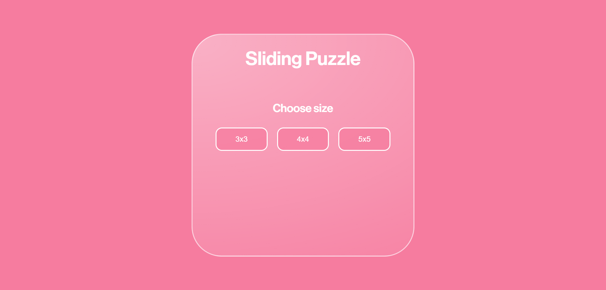
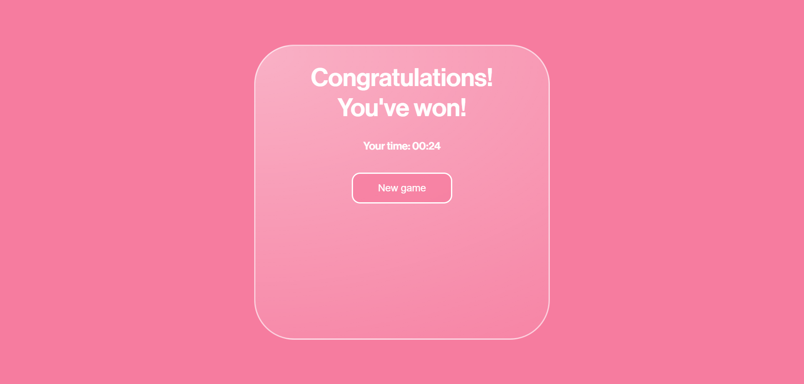

# Sliding Puzzle Game

This is a simple sliding puzzle game built with HTML, CSS, and JavaScript. The objective of the game is to arrange the tiles in numerical order by sliding them around.

## Author

Taipova Evgeniya

## Features

- **Choose Puzzle Size**: Select a grid size (3x3, 4x4, or 5x5) to set the difficulty of the game.
- **Timer**: Track the time taken to solve the puzzle.
- **Shuffle**: The tiles are shuffled at the start of each game to create a new puzzle.
- **Win Detection**: The game detects when the puzzle is correctly arranged and displays a congratulatory message.
- **New Game**: After winning, players can start a new game.

## Getting Started

### Prerequisites

To run this game, all you need is a modern web browser that supports JavaScript.

### Installation

1. Clone this repository or download the code.
2. Open `index.html` in your web browser to play the game.

### How to Play

1. Open the game by opening `index.html` in your web browser.
2. Select a grid size from the options (3x3, 4x4, or 5x5) to start a game.
3. The tiles will be shuffled, and a timer will start.
4. Click on tiles adjacent to the empty space to move them.
5. Arrange the tiles in ascending numerical order to win the game.
6. Once completed, the game will display your time and a congratulatory message.

### Files

- **index.html**: The main HTML file containing the structure of the game.
- **style.css**: CSS file for styling the game layout.
- **app.js**: JavaScript file containing the game logic.

## Code Overview

- **Event Listeners**: Detects the selected grid size and handles button clicks.
- **Functions**:
  - `createBoard()`: Generates the buttons based on the selected grid size.
  - `shuffle()`: Randomly shuffles the buttons at the beginning of the game.
  - `moveTile()`: Checks if a tile can move and swaps it with the empty space.
  - `controlWin()`: Checks if the puzzle is in the correct order to determine a win.
  - `timer()` and `resetTimer()`: Manages the timer display.

## Screenshots

  
  
  

## Technologies Used

- HTML
- CSS
- JavaScript
